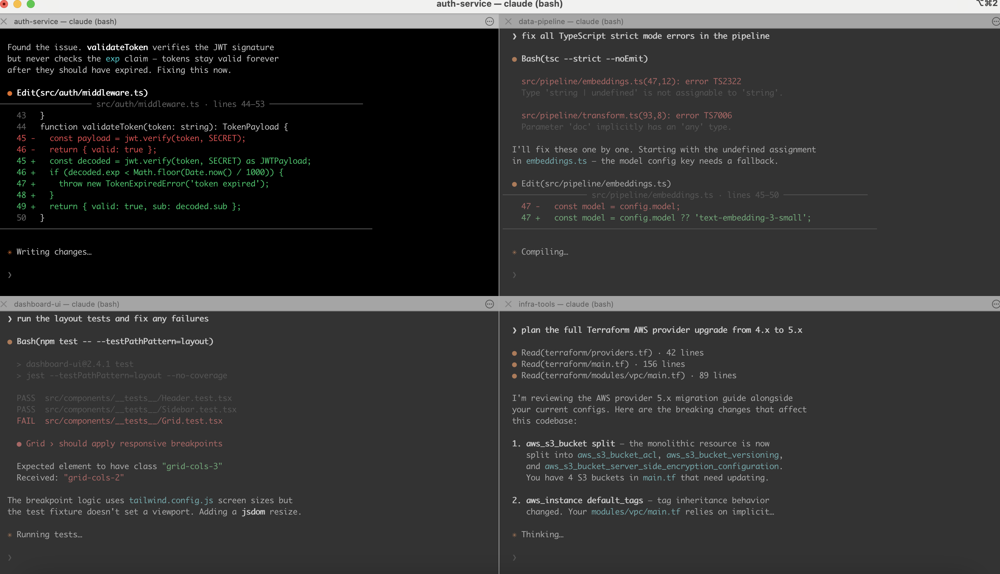
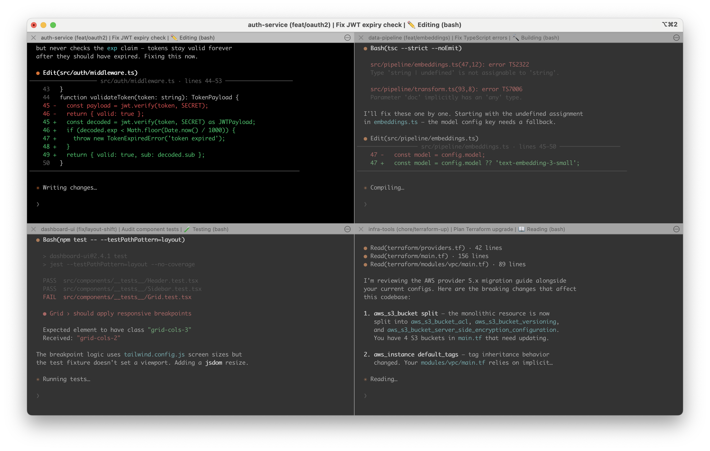

# **C**laude **C**ode **P**ane-Pulse &nbsp;`ccp`

> Dynamic terminal titles for Claude Code — see what each agent is actually doing at a glance

[](https://github.com/brianruggieri/claude-pane-pulse/actions/workflows/ci.yml)
[](https://opensource.org/licenses/MIT)
[](https://www.apple.com/macos/)
[](https://www.gnu.org/software/bash/)

**C**laude **C**ode **P**ane-Pulse (`ccp`) wraps the Claude Code CLI to automatically update your terminal pane titles with real-time status — building, testing, pushing, committing, and more — so you always know what each agent is working on at a glance. Perfect for split-pane terminals running multiple Claude Code sessions.

### Before ccp

Generic titles. You have no idea what's happening in each pane.



### With ccp

Each pane title shows the project, branch, current task, and live status — independently updated as Claude works.



> **iTerm2 note:** ccp writes to OSC 1 (the per-pane icon title) so every split pane gets its own independent live title. No two panes share a title bar. See [Terminal Support](#-terminal-support) for how other terminals compare.

## ✨ Features

- **🎬 Live Status Updates** — Building..., Testing..., Pushing... with real-time status text in the pane title
- **📊 Priority-Based Display** — Errors always show first, then active work, then completions
- **🏗️ Hook-Based Architecture** — Injects hooks into `.claude/settings.local.json` for structured status events (no fragile output parsing)
- **🔍 Auto-Title from Git** — Detects PR/issue/feature branches and generates titles automatically (PR #89, Issue #12, Feature: foo, etc.)
- **💾 Session Tracking** — Resume previous sessions by title with `--goto`
- **🎯 AI Task Summaries** — Optional: `--ai-context` summarizes your prompts to 3–5 words via claude-haiku (opt-in, uses your subscription)
- **👋 Welcome Status** — Shows `Welcome back, <FirstName>` on startup (from git config)
- **⚡ Zero Config** — Works out of the box on iTerm2, Terminal.app, tmux, WezTerm, Ghostty, and Kitty
- **🚀 Full Claude Passthrough** — All Claude Code flags (`-c/--continue`, `--model`, `--worktree`, etc.) pass straight through

## 🚀 Quick Start

```bash
# Install
git clone https://github.com/brianruggieri/claude-pane-pulse.git
cd claude-pane-pulse
./install.sh

# Use with auto-detection (default)
ccp

# With custom title
ccp "fixing the login bug"

# Quick formats
ccp --pr 89 "Fix auth bug"
ccp --feature "New login flow"
ccp --bug "Fix crash on startup"

# Resume a previous session's directory
ccp --goto "PR #89"

# Forward Claude flags
ccp -c                          # resume last conversation
ccp --model opus "My task"      # pass model to Claude
ccp --permission-mode bypassPermissions
ccp "My task" -- --resume abc123
```

## 📦 Installation

### Prerequisites

- **macOS** Sonoma or later (may work on earlier versions)
- **bash** 3.2+ (pre-installed on macOS)
- **jq** — Install with: `brew install jq`
- **Claude Code CLI** — See [claude.ai](https://claude.ai)

### Install

```bash
git clone https://github.com/brianruggieri/claude-pane-pulse.git
cd claude-pane-pulse
./install.sh
```

This installs `ccp` to `~/.local/share/ccp/` and symlinks `~/bin/ccp`.

## 📖 Usage

### Basic Commands

```bash
# Auto-detect title from current git branch
ccp

# Custom title
ccp "Working on authentication"

# List active sessions
ccp --list

# Resume a previous session's directory
ccp --goto "PR #89"

# Disable dynamic updates (static title)
ccp --no-dynamic "My task"
```

### Quick Title Formats

```bash
ccp --pr 89 "Fix memory leak"          # PR #89 - Fix memory leak
ccp --issue 12 "Refactor API"          # Issue #12 - Refactor API
ccp --feature "OAuth integration"      # Feature: OAuth integration
ccp --bug "Login crash"                # Bug: Login crash
ccp --refactor "Clean up code"         # Refactor: Clean up code
```

### Claude Flag Passthrough

Any Claude Code flag can be passed directly to `ccp` and forwarded to Claude:

```bash
# Resume conversation
ccp -c
ccp --continue

# Specify model
ccp --model opus "My task"

# Permission mode
ccp --permission-mode bypassPermissions

# Worktree
ccp --worktree feat-login "Fix login"

# System prompt
ccp --system-prompt "Be terse" "My task"

# Combine multiple flags
ccp --model sonnet --permission-mode acceptEdits

# Explicit passthrough with --
ccp "My task" -- --resume abc123 --model opus
```

### Dynamic Status Updates

The title automatically updates to show what Claude Code is doing:

```
Initial:    "project (main) | Fix auth bug"
Welcome:    "👋 Welcome back, Brian | Fix auth bug"
Thinking:   "💭 Thinking | Fix auth bug"
Editing:    "✏️ Editing | Fix auth bug"
Testing:    "🧪 Testing | Fix auth bug"
Passed:     "✅ Tests passed | Fix auth bug"
Committed:  "💾 Committed | Fix auth bug"
Pushing:    "⬆️ Pushing | Fix auth bug"
Idle:       "💤 Idle | Fix auth bug"
```


Each status updates in real time and is cleared after the operation completes.

### Status Profiles

Two status surfaces are available:

```bash
# Default (quiet) — high-signal statuses only
ccp "My task"

# Full lifecycle (verbose) — includes session/worktree/subagent/config events
ccp --status-profile verbose "My task"
```

### Title Format

```
project(branch) | task summary | status
```

Example: `my-project (main) | Fix Auth Bug | ✏️ Editing`

The **task summary** shows the first words of your prompt; with `--ai-context` enabled it becomes a 3–5 word AI-generated label. The **status** updates in real time based on hook events.


## 📊 Status Icons

| Icon | Status | Priority | Profile |
|------|--------|----------|---------|
| 🐛 | Error | 100 | both |
| ❌ | Tests failed | 90 | both |
| ⏸️ | Awaiting approval | 88 | both |
| 🙋 | Input needed | 85 | both |
| 🔨 | Building | 80 | both |
| 🧪 | Testing | 80 | both |
| 📦 | Installing | 80 | both |
| ⬆️ | Pushing | 75 | both |
| ⬇️ | Pulling | 75 | both |
| 🔀 | Merging | 75 | both |
| 🤖 | Delegating | 70 | both |
| 💭 | Thinking | 70 | both |
| 🐳 | Docker | 70 | both |
| ✏️ | Editing | 65 | both |
| ✅ | Tests passed | 60 | both |
| 💾 | Committed | 60 | both |
| 🏁 | Completed | 60 | both |
| 📖 | Reading | 55 | both |
| 🌐 | Browsing | 55 | both |
| 🖥️ | Running | 55 | both |
| 👋 | Welcome (startup) | — | both |
| 🚀 | Session started | — | verbose |
| 🧠 | Compacting | — | verbose |
| ✅ | Subagent finished | — | verbose |
| 👥 | Teammate idle | — | verbose |
| ⚙️ | Config changed | — | verbose |
| 🌿 | Worktree created | — | verbose |
| 🧹 | Worktree removed | — | verbose |
| 💤 | Idle | 10 | both |

Higher priority statuses override lower ones. Completion events (✅, 💾, 🏁) always appear immediately. Idle only appears after 60 seconds of no hook activity.

## 🎯 Multi-Pane Workflow

Perfect for running multiple Claude Code instances in split panes:

```bash
# Terminal split into 4 panes
# Pane 1
ccp --pr 89 "Fix auth"

# Pane 2
ccp --issue 12 "Refactor"

# Pane 3
ccp --feature "OAuth"

# Pane 4
ccp --bug "Login crash"
```

Each pane's title bar updates independently. Example pane titles while working:

```
✳ PR #89 - Fix auth | Fix auth bug | ✏️ Editing
✳ Issue #12 - Refactor | Refactor API layers | 🧪 Testing
✳ Feature: OAuth | Add OAuth provider | ✅ Tests passed
✳ Bug: Login crash | Fix login race condition | ⬆️ Pushing
```


## 🛠️ Configuration

### Auto-Title from Git Branch

Auto-detection recognizes these patterns:

```
pr/89-fix-auth          → PR #89 - fix auth
pull/89-fix-auth        → PR #89 - fix auth
issue/12-refactor-api   → Issue #12 - refactor api
fix/12-refactor-api     → Issue #12 - refactor api
bug/12-refactor-api     → Issue #12 - refactor api
feature/new-login       → Feature: new login
main                    → project-name (main)
```

Just run `ccp` with no arguments and the title is generated automatically.

### Status Profile Environment Variable

Set a default status profile via environment variable:

```bash
export CCP_STATUS_PROFILE=verbose
ccp "My task"  # will use verbose by default
```

Or override on the command line with `--status-profile quiet|verbose`.

### Disable Dynamic Updates

```bash
ccp --no-dynamic "Static title — no updates"
```

The title is set once and never changes. Useful if you prefer a clean, static title bar.

### Session Management

```bash
# List all active sessions
ccp --list

# Resume a previous session's directory
ccp --goto "PR #89"

# Exact title match
ccp --goto "PR #89 - Fix auth bug"
```

`--goto` finds a session by title (substring match) and changes to that directory, then launches Claude. This is NOT conversation resume — for that, use Claude's own `-c/--continue` flag.

## 📚 Documentation

- [Installation Guide](docs/installation.md)
- [Usage Guide](docs/usage.md)
- [Dynamic Titles](docs/dynamic-titles.md)
- [AI Context Summarization](docs/ai-context.md)
- [Contributing](CONTRIBUTING.md)

## 🤝 Contributing

Contributions welcome! Please read [CONTRIBUTING.md](CONTRIBUTING.md) first.

```bash
# Fork and clone
git clone https://github.com/YOUR_USERNAME/claude-pane-pulse.git

# Create feature branch
git checkout -b feature/amazing-feature

# Commit changes
git commit -m 'feat: add amazing feature'

# Push and create PR
git push origin feature/amazing-feature
```

## 📝 License

MIT © Brian Ruggieri — see [LICENSE](LICENSE)

## 🙏 Acknowledgments

- Built for [Claude Code](https://code.claude.com/) by Anthropic
- Inspired by the need for better multi-agent visibility
- Thanks to the shell scripting community

## 📮 Contact

- **Issues**: [GitHub Issues](https://github.com/brianruggieri/claude-pane-pulse/issues)
- **Email**: brianruggieri@gmail.com

---

**Star ⭐ this repo if you find it useful!**
